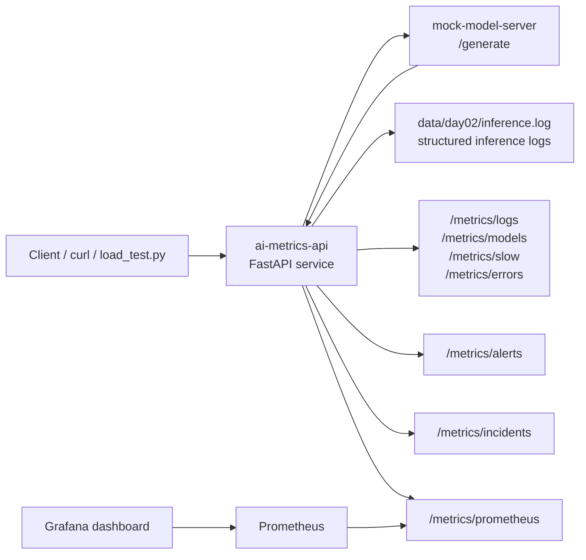

# ai-infra-learning

My AI infrastructure learning journey.

## AI Inference Observability and Reliability Platform

This repository contains a small AI inference observability project built with FastAPI, Docker Compose, Prometheus, Grafana, structured inference logs, alerting, incident diagnosis, load testing, and automated tests.

The goal of this project is to practice the engineering workflow around AI model serving:

- receive inference requests
- call a backend model service
- record structured inference logs
- calculate latency and error metrics
- expose Prometheus metrics
- visualize service health in Grafana
- detect alerts and incidents
- verify behavior with tests and load traffic

This is not a production-scale distributed system. It is a self-built learning project for understanding AI deployment, observability, and reliability.

## System Components

The Docker Compose stack includes:

- `ai-metrics-api`: FastAPI service for inference logs, metrics, alerts, incidents, and Prometheus metrics
- `mock-model-server`: mock backend model service used by `/v1/mock-infer`
- `prometheus`: scrapes metrics from `ai-metrics-api`
- `grafana`: loads the provisioned Prometheus datasource and dashboard

## Architecture



The main request flow is:

1. A client or load test sends an inference request to `/v1/mock-infer`.
2. `ai-metrics-api` calls the separated `mock-model-server`.
3. The API records the request result into `data/day02/inference.log`.
4. Metrics endpoints parse the log file and calculate request count, error rate, latency percentiles, slow requests, and model-level metrics.
5. `/metrics/prometheus` exposes these metrics in Prometheus text format.
6. Prometheus scrapes the API metrics endpoint.
7. Grafana reads from Prometheus and visualizes service health.
8. Alert and incident endpoints summarize abnormal error rate, latency, and model-level behavior.

## Run with Docker Compose

Start the full stack:

```bash
cd /workspaces/ai-infra-learning
docker compose up --build
```

Expected service URLs:

```text
AI metrics API:     http://127.0.0.1:8000
Mock model server:  http://127.0.0.1:8001
Prometheus:         http://127.0.0.1:9090
Grafana:            http://127.0.0.1:3000
```

Stop all services:

```bash
docker compose down
```

Restart from a clean compose state:

```bash
docker compose down
docker compose up --build
```

## Verify the Services

Run these commands in a second terminal while Docker Compose is running:

```bash
cd /workspaces/ai-infra-learning

curl -s http://127.0.0.1:8000/health | jq
curl -s http://127.0.0.1:8001/health | jq
curl -s http://127.0.0.1:8000/metrics/logs | jq
curl -s http://127.0.0.1:8000/metrics/alerts | jq
curl -s http://127.0.0.1:8000/metrics/incidents | jq
curl -s http://127.0.0.1:8000/metrics/prometheus | head -20
```

Expected result:

- `8000 /health` returns `ai-metrics-api`
- `8001 /health` returns `mock-model-server`
- `/metrics/logs` returns request counts, error rate, latency percentiles, slow requests, and model-level metrics
- `/metrics/prometheus` returns Prometheus text metrics such as `ai_inference_total_requests`, `ai_inference_error_rate`, and `ai_inference_p95_latency_ms`

## Send a Mock Inference Request

```bash
curl -i -s -X POST http://127.0.0.1:8000/v1/mock-infer \
  -H "Content-Type: application/json" \
  -d '{"model":"qwen2.5-7b","tokens_in":300,"tokens_out":80}'
```

Check that a new inference log line was written:

```bash
tail -n 3 data/day02/inference.log
```

## API Endpoints

AI metrics API:

```text
GET  /health
POST /v1/mock-infer
GET  /metrics/logs
GET  /metrics/slow
GET  /metrics/errors
GET  /metrics/models
GET  /metrics/alerts
GET  /metrics/incidents
GET  /metrics/prometheus
```

Mock model server:

```text
GET  /health
POST /generate
```

## Run Tests

```bash
python -m pytest -q
```

Current expected result:

```text
12 passed, 1 warning
```

The warning comes from FastAPI/Starlette test client internals and does not indicate a project behavior failure.

## Current Capabilities

The project currently supports:

- FastAPI inference metrics service
- separated mock model backend service
- structured inference log parsing
- service-level request, success, error, and latency metrics
- model-level request count, error count, average latency, P95 latency, and error rate
- slow request analysis
- error request filtering
- warning and critical alert generation
- incident diagnosis summary
- Prometheus metrics export
- service-level Prometheus metrics
- model-level Prometheus metrics with `model` labels
- Prometheus scrape configuration
- Grafana datasource and dashboard provisioning
- Docker Compose startup
- load testing script
- pytest-based automated tests
- model server failure handling

Example model-level Prometheus metrics:

```text
ai_inference_model_request_count{model="qwen2.5-7b"} 7
ai_inference_model_error_count{model="qwen2.5-7b"} 2
ai_inference_model_error_rate{model="qwen2.5-7b"} 0.2857
ai_inference_model_avg_latency_ms{model="qwen2.5-7b"} 289.0
ai_inference_model_p95_latency_ms{model="qwen2.5-7b"} 910
```

These metrics make it possible to compare traffic, errors, and latency across different model names.

## Load Test

Generate controlled traffic:

```bash
python scripts/load_test.py --count 10 --error-rate 0.1
```

After running the load test, check:

```bash
curl -s http://127.0.0.1:8000/metrics/logs | jq
curl -s http://127.0.0.1:8000/metrics/alerts | jq
curl -s http://127.0.0.1:8000/metrics/incidents | jq
```

Prometheus and Grafana should reflect the updated metrics after the API writes new inference logs.

## Current Limitations

- The inference log is stored in a local file instead of a database, queue, or log aggregation system.
- The backend model service is still a mock model server, not a real model runtime.
- The system is designed for local learning and demonstration, not production deployment.
- Kubernetes, distributed tracing, GPU metrics, and real model serving are future extensions.

## Next Steps

Planned improvements:

1. Add an architecture diagram.
2. Improve Prometheus metric semantics with model-level or endpoint-level labels.
3. Add a real model backend.
4. Add backend selection between mock and real model services.
5. Improve structured error handling.
6. Add a load test report with concrete metrics.
7. Polish final project documentation and resume bullets.