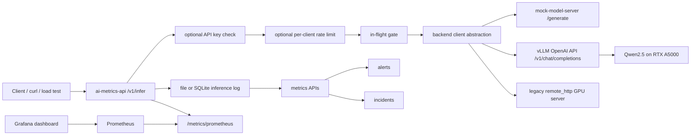

# AI Inference Observability and Reliability Platform

A learning-oriented AI infrastructure project for observing, benchmarking, and hardening LLM inference traffic.

This project builds an end-to-end single-GPU LLM serving reliability layer with FastAPI, vLLM, Prometheus, Grafana, structured inference logs, optional SQLite log storage, model-level metrics, mock failure injection, API key protection, request tracing, per-client rate limiting, API-side backpressure, and real Qwen2.5 GPU benchmark evidence.

It is not a production-scale distributed serving platform. It is designed to practice the engineering workflow behind LLM serving, observability, overload control, and reliability validation.

## What This Project Demonstrates

- Accept inference requests through a stable FastAPI `/v1/infer` endpoint
- Switch model backends with `MODEL_BACKEND=mock|remote_http|vllm`
- Keep a deterministic mock backend for reproducible failure injection and overload tests
- Route real requests to a vLLM OpenAI-compatible backend
- Normalize mock and vLLM responses into the same internal metrics shape
- Record structured inference logs for successful, failed, and rejected requests
- Store inference logs through a file or SQLite backend
- Calculate request count, success rate, error rate, latency percentiles, slow requests, alerts, and incident signals
- Expose Prometheus-compatible service-level, status-level, in-flight, rate-limit, and model-level metrics
- Visualize metrics in Grafana
- Apply API-side in-flight backpressure with HTTP 429 rejection
- Protect inference endpoints with optional API key authentication
- Propagate request and trace identifiers through responses and logs
- Apply optional per-client inference rate limiting
- Validate real Qwen2.5 serving on an NVIDIA RTX A5000 through vLLM
- Run a real GPU benchmark matrix across concurrency and output length
- Validate backpressure in front of a real vLLM backend, not only a mock backend

## System Components

The Docker Compose stack includes:

- `ai-metrics-api`: FastAPI service for inference requests, backend routing, logs, metrics, alerts, incidents, readiness, and Prometheus metrics
- `mock-model-server`: mock backend model service used for reproducible local validation
- `prometheus`: scrapes metrics from `ai-metrics-api`
- `grafana`: loads the provisioned Prometheus datasource and AI metrics dashboard

The repository also includes:

- `projects/ai_metrics_api/backend_clients.py`: backend client abstraction for mock and vLLM backends
- `projects/gpu_model_server`: earlier GPU model server with `template` and `transformers` runtime modes
- `scripts/concurrent_load_test.py`: concurrent load and serving benchmark script
- `docs`: validation, setup, protocol, reliability, and production-gap documentation
- `reports`: real GPU validation and vLLM benchmark reports

## Architecture



Main request flow:

1. A client sends an inference request to `/v1/infer`.
2. The API optionally validates an API key.
3. The API resolves request, trace, and client identifiers.
4. The API applies optional per-client rate limiting.
5. The API checks the in-flight gate.
6. Accepted requests are routed to the configured backend.
7. Rejected requests return HTTP 429 and are logged.
8. Backend responses are normalized into `model`, `status`, `latency_ms`, `tokens_in`, and `tokens_out`.
9. The API records a structured inference log entry through the configured log backend.
10. Metrics endpoints calculate latency, error rate, status counts, and model-level metrics.
11. Prometheus scrapes `/metrics/prometheus`.
12. Grafana visualizes service-level and model-level observability.

## Quickstart

Start the full local mock stack:

```bash
cd /workspaces/ai-infra-learning
docker compose up --build
```

Service URLs:

```text
AI metrics API:     http://127.0.0.1:8000
Mock model server:  http://127.0.0.1:8001
Prometheus:         http://127.0.0.1:9090
Grafana:            http://127.0.0.1:3000
```

Run tests:

```bash
python -m pytest -q
```

Expected result:

```text
all tests passed, with at most the known FastAPI / Starlette TestClient warning
```

The exact test count changes as coverage grows. The FastAPI / Starlette TestClient warning does not indicate a project failure.

For the full local validation workflow, see:

```text
docs/LOCAL_VALIDATION.md
```

## Core API Endpoints

AI metrics API:

```text
GET  /health
GET  /ready
POST /v1/infer
POST /v1/mock-infer
GET  /metrics/logs
GET  /metrics/models
GET  /metrics/slow
GET  /metrics/errors
GET  /metrics/alerts
GET  /metrics/incidents
GET  /metrics/prometheus
```

Mock model server:

```text
GET  /health
POST /generate
```

vLLM backend:

```text
GET  /v1/models
POST /v1/chat/completions
GET  /metrics
```

Earlier GPU model server:

```text
GET  /health
GET  /ready
POST /generate
```

## Backend Modes

The metrics API supports backend switching:

```text
MODEL_BACKEND=mock
MODEL_BACKEND=vllm
```

`mock` is the default backend for local development, repeatable validation, failure injection, and overload experiments.

`vllm` calls an OpenAI-compatible vLLM server through `/v1/chat/completions` and maps vLLM usage into the internal response shape used by structured logs and metrics.

Runtime variables:

```text
MODEL_BACKEND=mock|remote_http|vllm
MOCK_MODEL_SERVER_URL=http://mock-model-server:8001/generate
MODEL_SERVER_URL=http://mock-model-server:8001/generate
VLLM_BASE_URL=http://127.0.0.1:8001/v1
VLLM_MODEL=Qwen/Qwen2.5-0.5B-Instruct
MODEL_SERVER_TIMEOUT_SEC=60
READINESS_CHECK_BACKEND=false
LOG_BACKEND=file|sqlite
INFERENCE_LOG_PATH=/app/data/day02/inference.log
SQLITE_LOG_PATH=/app/data/day02/inference.sqlite3
REQUIRE_API_KEY=false
API_KEY=
MAX_IN_FLIGHT_REQUESTS=8
ADMISSION_MODE=reject|queue
MAX_QUEUE_SIZE=32
QUEUE_TIMEOUT_MS=500
RATE_LIMIT_ENABLED=false
RATE_LIMIT_MAX_REQUESTS=60
RATE_LIMIT_WINDOW_SECONDS=60
```

The older `remote_http` and `projects/gpu_model_server` path remains documented as an earlier GPU validation path, but the current LLM serving benchmark uses vLLM.

Backend protocol details:

```text
docs/MODEL_BACKEND_PROTOCOL.md
```

GPU server setup and earlier Transformers validation path:

```text
docs/GPU_SERVER_SETUP.md
projects/gpu_model_server/README.md
```

## Observability Features

The project exposes service-level, status-level, in-flight, and model-level metrics.

Service-level examples:

```text
ai_inference_total_requests
ai_inference_success_requests
ai_inference_failed_requests
ai_inference_error_rate
ai_inference_p95_latency_ms
ai_inference_p99_latency_ms
ai_inference_slow_request_count
ai_inference_current_in_flight_requests
ai_inference_queue_depth
ai_inference_queue_rejected_total
ai_inference_queue_timeout_total
ai_inference_rate_limit_enabled
ai_inference_rate_limit_active_clients
ai_inference_rate_limit_rejected_total
ai_inference_status_requests{status="..."}
```

Model-level examples:

```text
ai_inference_model_requests{model="..."}
ai_inference_model_errors{model="..."}
ai_inference_model_error_rate{model="..."}
ai_inference_model_p95_latency_ms{model="..."}
```

vLLM metrics captured during the GPU benchmark include:

```text
vllm:num_requests_running
vllm:num_requests_waiting
vllm:prompt_tokens_total
vllm:generation_tokens_total
```

Grafana dashboard panels include:

- Total Requests
- Error Rate
- P95 Latency
- Failed Requests
- Slow Requests
- Status Requests by Code
- Model Request Count
- Model Error Rate
- Model P95 Latency
- Current In-Flight Requests
- Admission Queue Depth
- Queue Rejections
- Queue Timeouts
- Admission Mode
- Rate Limit Enabled
- Rate Limit Active Clients
- Rate Limit Rejections
- P95 Latency from Histogram Buckets

## Reliability Features

The project includes reliability-focused behavior:

- Failed backend calls are written to the inference log
- Inference logs can be stored in local files or SQLite
- Backend unavailable errors become structured `502` responses
- Backend timeouts become structured `504` responses
- Invalid backend responses become structured `502` responses
- vLLM backend responses are normalized into the same log and metrics shape as mock responses
- API-side in-flight backpressure rejects overload with HTTP 429
- Optional per-client rate limiting rejects excess client traffic with HTTP 429
- Rejected requests are logged and counted in Prometheus status metrics
- Request and trace identifiers are preserved in responses and logs
- The in-flight gauge returns to 0 after successful, failed, and rejected paths
- `ai-metrics-api` exposes `/health` and `/ready`

This makes user-visible failures and overload behavior observable through logs, metrics, and incident signals.

## Real vLLM GPU Serving Validation

The project was validated against a real vLLM backend using:

```text
Host: A5000 lab GPU server
GPU: NVIDIA RTX A5000, GPU 0 only
Model: Qwen/Qwen2.5-0.5B-Instruct
vLLM: 0.11.0
CUDA_VISIBLE_DEVICES=0
```

Validation completed on August 18, 2026:

- vLLM `/v1/models` smoke test succeeded
- vLLM `/v1/chat/completions` smoke test succeeded
- `/v1/infer` routed through real vLLM successfully
- Small real-vLLM load sample completed with 10/10 HTTP 200
- Real-backend backpressure test completed with 28 HTTP 429 responses out of 30 requests when `MAX_IN_FLIGHT_REQUESTS=2`
- Full benchmark matrix completed with 750/750 successful requests
- Sustained vLLM soak completed with 600/600 benchmark requests returning HTTP 200 and logical status 200

Benchmark matrix:

```text
concurrency: 1, 2, 4, 8, 16
max_tokens: 32, 128, 512
requests per case: 50
```

Aggregate matrix result:

```text
total_requests: 750
success_requests: 750
failed_requests: 0
error_rate: 0.0
vllm:prompt_tokens_total: 48600
vllm:generation_tokens_total: 165754
GPU 0 memory after matrix: about 12485 MiB / 24564 MiB
```

Full report:

```text
reports/vllm_benchmark_2026_08_18/README.md
```

Additional sustained real-backend soak report:

```text
reports/vllm_soak_2026_08_19/README.md
```

Earlier Transformers GPU backend validation report:

```text
reports/gpu_backend_observability_report.md
```

## Local Validation

Final local validation covered:

- Unit tests
- Docker Compose startup
- API health and readiness
- Mock model server health
- Deterministic inference request
- Concurrent load test
- Mock backend failure injection
- Mock backend delay and overload
- API-side backpressure
- Log metrics
- Prometheus metrics
- Prometheus target health
- Grafana health
- Grafana dashboard provisioning

Validation document:

```text
docs/LOCAL_VALIDATION.md
```

Grafana API validation should use the admin password configured in `docker-compose.yml`.

## Production Gaps

This project intentionally documents its production boundaries. It includes local Docker Compose validation, minikube validation for the example Kubernetes manifests, Docker image build CI, and real single-GPU vLLM benchmark evidence, but it does not yet include production-grade distributed controls such as:

- Full authorization, tenant management, or OIDC integration
- Distributed rate limiting across API replicas
- Distributed global backpressure across API replicas
- External durable log storage such as Postgres, ClickHouse, or object storage
- Long-term metrics retention
- Distributed tracing backend integration such as OpenTelemetry collector plus Jaeger or Tempo
- Managed GPU scheduling
- Autoscaling
- SLO ownership and alert routing
- A published image registry release
- Production Kubernetes cluster deployment evidence
- ServiceMonitor or managed Prometheus integration
- Cost and capacity management

Production gap analysis:

```text
docs/PRODUCTION_GAPS.md
```

## Documentation Index

```text
docs/LOCAL_VALIDATION.md
docs/MODEL_BACKEND_PROTOCOL.md
docs/GPU_SERVER_SETUP.md
docs/PRODUCTION_GAPS.md
docs/K8S_VALIDATION.md
docs/reliability_experiments.md
projects/gpu_model_server/README.md
reports/gpu_backend_observability_report.md
reports/vllm_benchmark_2026_08_18/README.md
```

## Project Boundary

This repository is a learning project, not a production service.

The current system is best described as a single-GPU LLM serving reliability layer. It validates the operational path around inference serving:

```text
request -> admission control -> backend -> structured log -> metrics -> Prometheus -> Grafana -> alerts -> incidents
```

Current limits are intentional and documented: single GPU, one API replica by default in the Kubernetes example manifests, in-memory admission and rate-limit state, local file or SQLite logs, no distributed global rate limit, no external database, and no custom batching layer because vLLM owns the serving engine.

## Operations

- [Alerting runbook](docs/ALERTING_RUNBOOK.md)
- [Real vLLM admission control benchmark](reports/vllm_admission_control_2026_08_19/README.md)
