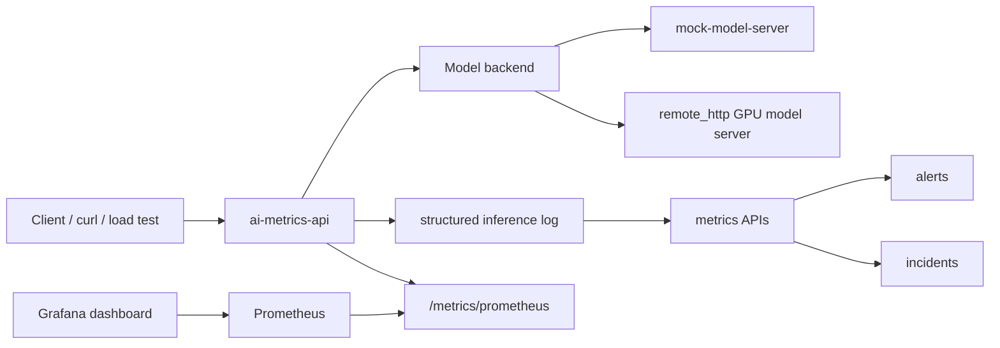

# AI Inference Observability and Reliability Platform

A learning-oriented AI infrastructure project for observing and diagnosing AI inference traffic.

This project builds a small but end-to-end inference observability system with FastAPI, Docker Compose, Prometheus, Grafana, structured inference logs, model-level metrics, backend failure handling, and real GPU backend validation.

It is not a production-scale serving platform. It is designed to practice the engineering workflow behind AI model serving, observability, and reliability.

## What This Project Demonstrates

- Accept inference requests through a FastAPI metrics API
- Route requests to either a mock backend or a remote HTTP model backend
- Record structured inference logs
- Calculate request count, success rate, error rate, latency percentiles, slow requests, alerts, and incident signals
- Expose Prometheus-compatible service-level and model-level metrics
- Visualize metrics in Grafana
- Validate the same observability pipeline against a real GPU-backed Qwen model server
- Capture backend failures as logs, metrics, and incident signals
- Separate liveness and readiness checks for deployable services

## System Components

The Docker Compose stack includes:

- `ai-metrics-api`: FastAPI service for inference requests, logs, metrics, alerts, incidents, readiness, and Prometheus metrics
- `mock-model-server`: mock backend model service used for reproducible local validation
- `prometheus`: scrapes metrics from `ai-metrics-api`
- `grafana`: loads the provisioned Prometheus datasource and AI metrics dashboard

The repository also includes:

- `projects/gpu_model_server`: GPU model server with `template` and `transformers` runtime modes
- `docs`: validation, setup, protocol, and production-gap documentation
- `reports`: GPU backend validation report

## Architecture



Main request flow:

1. A client sends an inference request to `ai-metrics-api`.
2. The API routes the request to the configured model backend.
3. The API records a structured inference log entry.
4. Metrics endpoints calculate latency, error rate, slow requests, and model-level metrics.
5. Prometheus scrapes `/metrics/prometheus`.
6. Grafana visualizes service-level and model-level observability.
7. Alert and incident endpoints summarize abnormal behavior.

## Quickstart

Start the full local stack:

```bash
cd /workspaces/ai-infra-learning
docker compose up --build
```

Service URLs:

```text
AI metrics API:     http://127.0.0.1:8000
Mock model server:  http://127.0.0.1:8001
Prometheus:         http://127.0.0.1:9090
Grafana:            http://127.0.0.1:3000
```

Run tests:

```bash
python -m pytest -q
```

Expected result:

```text
56 passed, 1 warning
```

The warning comes from FastAPI / Starlette TestClient and does not indicate a project failure.

For the full validation workflow, see:

```text
docs/LOCAL_VALIDATION.md
```

## Core API Endpoints

AI metrics API:

```text
GET  /health
GET  /ready
POST /v1/infer
POST /v1/mock-infer
GET  /metrics/logs
GET  /metrics/models
GET  /metrics/slow
GET  /metrics/errors
GET  /metrics/alerts
GET  /metrics/incidents
GET  /metrics/prometheus
```

Mock model server:

```text
GET  /health
POST /generate
```

GPU model server:

```text
GET  /health
GET  /ready
POST /generate
```

## Backend Modes

The metrics API supports two backend modes:

```text
MODEL_BACKEND=mock
MODEL_BACKEND=remote_http
```

`mock` is the default backend for local development and repeatable validation.

`remote_http` allows the same observability pipeline to call a separate model server, including a GPU-backed server.

The GPU model server supports two runtime modes:

```text
GPU_MODEL_MODE=template
GPU_MODEL_MODE=transformers
```

`template` mode returns protocol-compatible responses with estimated latency.

`transformers` mode runs a Hugging Face Transformers model and returns the same response protocol.

Backend protocol details:

```text
docs/MODEL_BACKEND_PROTOCOL.md
```

GPU server setup:

```text
docs/GPU_SERVER_SETUP.md
projects/gpu_model_server/README.md
```

## Observability Features

The project exposes both service-level and model-level metrics.

Service-level examples:

```text
ai_inference_total_requests
ai_inference_success_requests
ai_inference_failed_requests
ai_inference_error_rate
ai_inference_p95_latency_ms
ai_inference_p99_latency_ms
ai_inference_slow_request_count
```

Model-level examples:

```text
ai_inference_model_requests{model="..."}
ai_inference_model_errors{model="..."}
ai_inference_model_error_rate{model="..."}
ai_inference_model_p95_latency_ms{model="..."}
```

Grafana dashboard panels include:

- Total Requests
- Error Rate
- P95 Latency
- Slow Requests
- Model Request Count
- Model Error Rate
- Model P95 Latency

## Reliability Features

The project includes reliability-focused behavior:

- Failed backend calls are written to the inference log
- Backend unavailable errors become structured `502` responses
- Backend timeouts become structured `504` responses
- Invalid backend responses become structured `502` responses
- Transformers dependency failures return structured errors
- Transformers model loading failures return structured errors
- Transformers generation failures return structured errors
- `ai-metrics-api` exposes `/health` and `/ready`
- `gpu-model-server` exposes `/health` and `/ready`

This makes user-visible failures observable through logs, metrics, and incident signals.

## GPU Backend Validation

The project was validated against a real GPU-backed model server using:

```text
NVIDIA RTX A5000
Qwen/Qwen2.5-0.5B-Instruct
GPU_MODEL_MODE=transformers
CUDA_VISIBLE_DEVICES=0
```

The GPU validation covered:

- Successful remote HTTP inference through the metrics API
- Backend failure retest
- 10-request stability sample
- Small-token vs large-token latency comparison
- Final GPU smoke test with `/health`, `/ready`, and `/generate`

Full report:

```text
reports/gpu_backend_observability_report.md
reports/vllm_benchmark_2026_08_18/README.md
```

## Local Validation

Final local validation covered:

- Unit tests
- Docker Compose startup
- API health and readiness
- Mock model server health
- Deterministic inference request
- Log metrics
- Prometheus metrics
- Prometheus target health
- Grafana health
- Grafana dashboard provisioning

Validation document:

```text
docs/LOCAL_VALIDATION.md
```

Grafana API validation should use the admin password configured in `docker-compose.yml`.

## Production Gaps

This project intentionally focuses on learning and core observability workflow. It does not yet include production-grade controls such as:

- Authentication and authorization
- Rate limiting
- Distributed request queueing and global backpressure
- Durable log storage
- Long-term metrics retention
- Distributed tracing
- GPU scheduling
- Autoscaling
- SLO ownership and alert routing
- Production deployment manifests
- Cost and capacity management

Production gap analysis:

```text
docs/PRODUCTION_GAPS.md
```

## Documentation Index

```text
docs/LOCAL_VALIDATION.md
docs/MODEL_BACKEND_PROTOCOL.md
docs/GPU_SERVER_SETUP.md
docs/PRODUCTION_GAPS.md
projects/gpu_model_server/README.md
reports/gpu_backend_observability_report.md
reports/vllm_benchmark_2026_08_18/README.md
```

## Project Boundary

This repository is a learning project, not a production service.

The core value is not serving the largest model. The core value is building and validating the operational path around AI inference:

```text
request -> backend -> structured log -> metrics -> Prometheus -> Grafana -> alerts -> incidents
```
## Reliability Experiments

This project includes controlled reliability experiments for the inference serving path.

The experiments cover:

- Successful inference traffic
- Backend logical failure traffic
- Overload and API-side backpressure

Key result:

With `MAX_IN_FLIGHT_REQUESTS=2`, `MOCK_MODEL_DELAY_SCALE=1.0`, and client concurrency set to 10, the API rejected 28 out of 50 requests with HTTP 429 while completing 22 requests successfully. The Prometheus status metrics and log analyzer both captured the 200/429 split, and the final in-flight gauge returned to 0.

See [docs/reliability_experiments.md](docs/reliability_experiments.md) for the full experiment setup, commands, results, and interpretation.

## Real vLLM Benchmark and Backpressure Result

The project now includes real vLLM serving validation on a lab NVIDIA RTX A5000.

Key results:

- Qwen/Qwen2.5-0.5B-Instruct served through vLLM 0.11.0
- `/v1/infer` routed to vLLM through `MODEL_BACKEND=vllm`
- Small load sample: 10/10 HTTP 200
- Real backend backpressure: 28 HTTP 429 responses out of 30 requests with `MAX_IN_FLIGHT_REQUESTS=2`
- Full benchmark matrix: 750/750 successful requests across concurrency 1/2/4/8/16 and max_tokens 32/128/512
- Final in-flight gauge returned to 0
- vLLM metrics captured prompt and generation token totals
- GPU 0 only was used; GPU 1/2/3 remained unused by vLLM

See [reports/vllm_benchmark_2026_08_18/README.md](reports/vllm_benchmark_2026_08_18/README.md).
